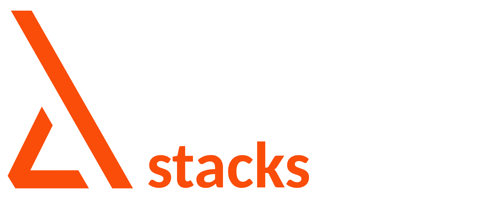

# Gum

Gum is a collection of tools focusing mainly on game development with the goal of getting rid of the boilerplate code.

## Table Of Contents

- [Installation](#installation)
- [Pooling](#pooling)
- [Composer](#composer)
- [Signals(pub/sub)](#signals)

# Trusted By

| [GoArt Metaverse](https://www.goartmetaverse.com/) | [Roof Stacks](https://roofstacks.com/) | [Gleam Games](https://www.gleamgames.com/) |
| :---: | :---: | :---: |
|    |  |  |

You can create a pull request or email me directly to display your game/company here emrefistikcioglu@gmail.com

## Installation

# Unity Installation
Add this to the ```Packages\manifest.json```

```
"scopedRegistries": [
    {
        "name": "NPM",
        "url": "https://registry.npmjs.org",
        "scopes": [
        "com.erkerkiii.gum"
        ]
    }
]
```

Dependencies
```
 "dependencies": {
    "com.erkerkiii.gum":  "1.0.17"
    }
```

# Nuget Installation

Nuget packages are available for C# projects. Installation with the dotnet CLI:

```
dotnet add package Gum.Core
dotnet add package Gum.Composer
dotnet add package Gum.Pooling
dotnet add package Gum.Signal
dotnet add package Gum.WebRequest
```

> :warning: Nuget installation **doesn't** include any Unity features.

## Pooling
This is a very basic implementation of the pooling system.
```CSharp
PoolBuilder<Foo> poolBuilder = new PoolBuilder<Foo>();
IPool<Foo> pool = _poolBuilder
                .SetPoolType(PoolType.Stack) //this is the default pool type
                .FromPoolableInstanceProvider(new FooInstanceProvider())
                .WithInitialSize(10) //this is 0 by default
                .Build();
```

Alternatively, you can use ```FromMethod```
```CSharp
IPool<Foo> pool = _poolBuilder
                .SetPoolType(PoolType.Stack)
                .FromMethod(Create)
                .Build();
```

Pool usage
```CSharp
Foo foo = pool.Get(); //gets an object from the pool, if it doesn't exists it creates one

public class Foo : IPoolable
{
    public event Action OnReturnToPoolRequested;

    public void Reset()
    {
        //reset object's values   
    }

    public void Erase()
    {
        //delete the object
        GC.SuppressFinalize(this);
    }
}
```

Pool usage with Unity's MonoBehaviour

```CSharp
public class Foo : MonoBehaviour, IPoolable
{
    public event Action OnReturnToPoolRequested;

    public Reset()
    {
        gameObject.SetActive(true);  
    }
    
    public void ReturnToPool()
    {
        gameObject.SetActive(false);
        OnReturnToPoolRequested.Invoke();      
    }

    public void Erase()
    {
        if(this == null) //to avoid race conditions with Unity's object life-time
        {
            return;
        }
    
        Destroy(gameObject);
    }
}
```

PoolCollection<TKey, TValue> usage
```CSharp
PoolBuilder<Foo> poolBuilder = new PoolBuilder<Foo>();
//configuring the builder
poolBuilder
          .FromPoolableInstanceProvider(new FooInstanceProvider())
          .SetPoolType(PoolType.Stack);

PoolCollection<int, Foo> poolCollection = new PoolCollection<int, Foo>(poolBuilder);

int key = 0;

Foo foo = _poolCollection.Get(key); //gets an object from the pool with the specific key, creates one if the pool is empty
```

## Composer
<p>Composer allows you to work with data compositions instead of inheritance thus allowing you to create data agnostic systems and cleaner, decoupled code.</p>
<p>In order to work with the Composer, you have to use the aspect system.</p>

1. Go to ```Gum.Composer\Aspects```
2. Create a file with extension ".gum"
3. Start typing your aspect
4. Run the codegen using ```CompositionCodeGenerator.Run()``` or use [editor tool](#aspect-creator-tool) for calling codegen.

> **_NOTE:_**  Editor tool is available for creating aspects. Check out [editor tool](#aspect-creator-tool) for more information.

Example aspect file
MyAspect.gum
```
aspect MyAspect 
{
    int MyInt;
    
    string MyAspect;
    
    double MyDouble;
    
    Transform MyTransform;
    
    Vector3 MyVector3;
}
```
You can use ANY object type while creating aspects.

```CSharp
private void Run()
{
    //you can call this method from anywhere (from unity editor or a console application)
    CompositionCodeGenerator.Run(); 
}
```

You can use the ```Gum.Composer\UserConfig.cs``` to configure the codegen.

```CSharp
public struct Foo : IComposable
{
    public int foo;
    
    public string bar;
    
    public Vector3 baz;

    public Composition GetComposition() //this part has to be written manually
    {
        //use array pools to allocate less
	//3 = length of the requested array
        IAspect[] aspects = ArrayPool<IAspect>.GetPool(3).Get();
        aspects[0] = new FooAspect(foo);
        aspects[1] = new BarAspect(bar);
        aspects[2] = new BazAspect(baz);
        return Composition.Create(aspects);
    }
}

public class Bar : IComposable
{
    public double qux;
    
    public string bar;
    
    public Composition GetComposition()
    {
	//2 = length of the requested array
        IAspect[] aspects = ArrayPool<IAspect>.GetPool(2).Get();
        aspects[0] = new QuxAspect(qux);
        aspects[1] = new BarAspect(bar);
        return Composition.Create(aspects);
    }
}

//as you can see this method can use both Foo and and Bar to operate
public void UseAspects(IComposable composable)
{
    //always use the disposable pattern or manually dispose composition
    using (Composition composition = composable.GetComposition())
    {
        BarAspect barAspect = _composition.GetAspect<BarAspect>();				
    }
}
```

### MonoComposable 

Composition is also available for Unity `MonoBehaviours `. Deriving from the abstract `MonoComposable` class enables using composition on Unity objects. `MonoComposable` class handles creation of composable, deriving classes only responsible for implementing the `GetAspects()` absrtact method to assign aspects.

```CSharp
public class FooMonoComposable : MonoComposable
{
    private int _value = 12;

    protected override IAspect[] GetAspects() // Deriving class implements GetAspects method.
    {
	//1 = length of the requested array
        IAspect[] aspects = ArrayPool<IAspect>.GetPool(1).Get();
        aspects[0] = new FooAspect(_value);
        return aspects;
    }
}
```

### Other usages
```CSharp
composition
    .GetAspectFluent(out FooAspect fooAspect)
    .GetAspectFluent(out BarAspect barAspect);
	
BarAspect barAspect = (BarAspect)_composition[BarAspect.ASPECT_TYPE];

composition.AddAspect(new BarAspect());

composition.SetAspect(new BarAspect());

composition.RemoveAspect(BarAspect.ASPECT_TYPE);

foreach (IAspect aspect in composition)
{
    BarAspect barAspect = (BarAspect)aspect;
}
```
## Aspect Creator Tool

Editor tool for aspect creation is located on Gum/Composition/AspectCreator on the editor menu. Aspect creator automates adding new aspects to the project. It generates aspects with given name to aspects folder with ".gum" extention. In order to generate aspect, it's required add least one field including it's Type and field name. Aspect generator includes built-in types but it can be extendable via adding new types.  

<p align="center">
  
</p>

Basic usage:

<p align="center">
  
</p>

Adding new types for extending:

<p align="center">
  
</p>

## Signals
```Gum.Signals``` is a very light-weight and simple pub/sub system.

Usage

```Csharp
public readonly struct FooSignal
{
    public readonly int Value;

    public FooSignal(int value)
    {
        Value = value;
    }
}
```
	
```Csharp
SignalCenter signalCenter = new SignalCenter(); //pass this reference to places of usage (preferably with a DI framework)

private void Bar(FooSignal fooSignal)
{
    //do stuff
}

signalCenter.Subscribe<FooSignal>(Action); //to subscribe
signalCenter.Unsubscribe<FooSignal>(Action); //to unsubscribe
signalCenter.Fire(new FooSignal()); //to fire signals
```
